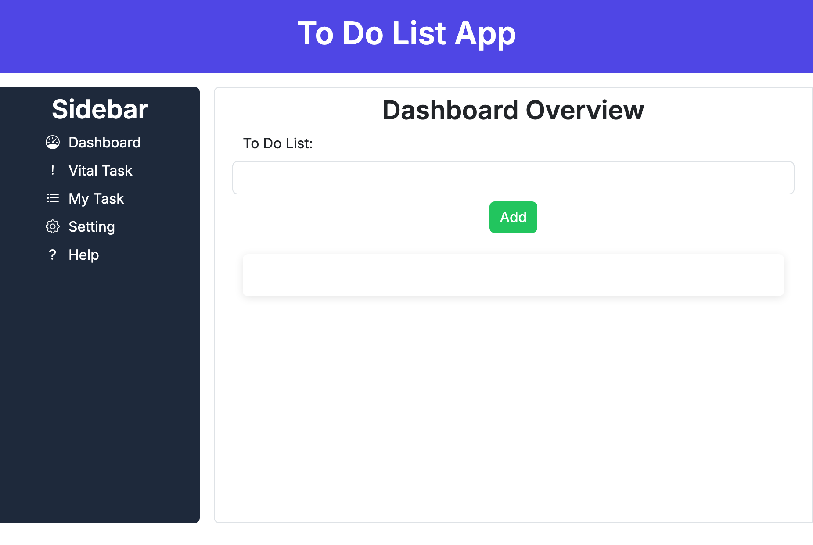

# Interactive To-Do List App

A responsive web-based To-Do List application built with **HTML**, **CSS**, **Bootstrap**, and **JavaScript**. This project allows users to manage their daily tasks by adding, editing, and deleting tasks dynamically using DOM manipulation.

## Features

* Add new tasks
* Prevent empty task submissions
* Prevent duplicate tasks
* Edit existing tasks
* Delete tasks
* Add tasks using the **Enter** key
* Responsive design for desktop and mobile devices
* Mobile-friendly sidebar with icons
* Dynamic task management using JavaScript

## Technologies Used

* HTML5
* CSS3
* Bootstrap 5
* Bootstrap Icons
* JavaScript (ES6)
* Google Fonts (Inter)

## Learning Outcomes

This project demonstrates:

* DOM manipulation using JavaScript
* Event handling with event listeners
* Form validation
* Creating, updating, and deleting DOM elements
* Working with arrays to manage application state
* Responsive web design using CSS media queries
* Dynamic user interaction without page reloads

## Project Structure

```text
interactive-to-do-list/
│
├── index.html
│
├── assets/
│   ├── css/
│   │   └── style.css
|   |── images/
│   │   └── todo-list-app.png
│   │
│   └── js/
│       └── script.js
│
└── README.md
```

## How to Run the Project

1. Clone the repository:

```bash
git clone https://github.com/your-username/interactive-to-do-list.git
```

2. Navigate to the project folder:

```bash
cd interactive-to-do-list
```

3. Open `index.html` in your browser.

No additional installation or dependencies are required.

## Screenshots



### Desktop View

* Sidebar navigation
* Task management dashboard
* Edit and delete functionality

### Mobile View

* Responsive layout
* Icon-only sidebar
* Mobile-friendly action buttons

## Future Improvements

* Save tasks using Local Storage
* Add task categories
* Add task priorities
* Add due dates
* Dark mode support
* Drag-and-drop task sorting

## Author

**Rupesh Rana**

Full Stack Developer Student

## Live Demo

GitHub Pages Deployment:

https://rrana5106.github.io/iteractive-to-do-list/

## Repository

GitHub Repository:

https://github.com/rrana5106/iteractive-to-do-list
